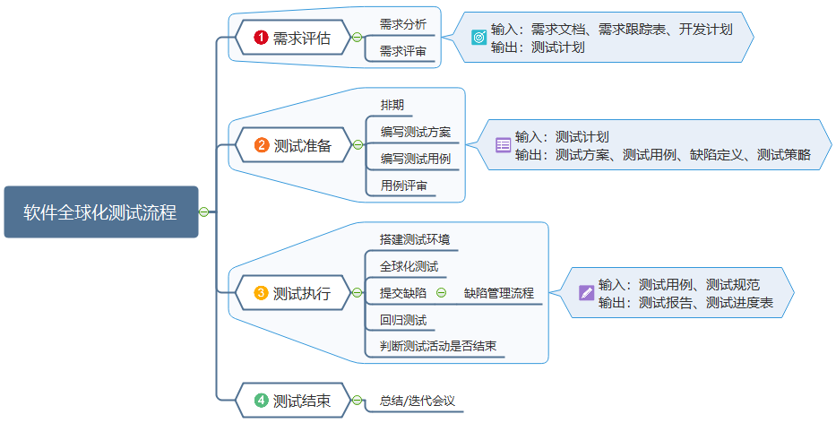

# openEuler社区软件全球化测试指南

# 1 软件全球化

随着全球市场经济的发展，软件产品可能在全球范围内发行，拥有来自世界各地的用户。如果产品只提供一种区域的语言，将很难生存。诸如用户界面（UI）、各国多语言、货币、日期格式、计量单位等因素会影响产品在全球的竞争力。

软件全球化（Software Globalization）包括软件本地化（Localization）与软件国际化（Internationalization）两方面。


# 2 软件全球化测试流程

                               


# 3 国际化/本地化测试需要关注的点

国际化/本地化测试人员需要关注如下一些方面：

## 3.1 内容问题

#### 翻译问题

尽管翻译只是整个国际化/本地化工作的一部分，但是从测试角度看这是至关重要的一环，最明显的问题是如何测试用其它语言做的产品。

软件测试员或者测试小组至少要对所测试的语言基本熟悉，能够驾驭软件，看懂软件显示的文字，输入必要的命令执行测试。

对多种语言（一般指非英语的语言）的情况，可以委托专门的国际化/本地化测试员进行测试。

#### 文字和图片的意义

软件的国际化/本地化除了语言，还需要考虑地域（region或locale），即用户的国家和地理位置，使软件适应特定地域特征，照顾到语言、方言、地区习俗和文化。

## 3.2 测试量大小

如果软件从一开始就考虑到了国际化/本地化问题，那么国际化/本地化版本中包含更多软件缺陷和增大测试量的风险就很小。

注意：国际化/本地化测试量的要求是一个有风险的选择。

如果国际化/本地化工作只限于修改诸如文本和图形等内容——不是代码，测试工作可能只是对改动进行合法性检查。如改动基本代码，则需考虑测试代码，并且检查功能和内容。

# 4 国际化测试

软件国际化版本是本地化版本的基础，国际化版本的优劣直接影响本地化版本的质量和开发的成本。

## 4.1 通用功能

- 测试在各种语言环境下，应用程序是否能被正确地安装；
- 测试在PC端和移动端（如涉及），应用程序的信息能否正确、完整地显示；
- 各种操作系统和用户区域设置下，通用功能是否能正确地使用；
- 在不同操作系统和各区域设置下，应用程序是否能被正确地卸载。

## 4.2 文本处理功能

- 使用不同区域的输入法编辑器交互式输入文本时，系统的反应；

- 多语言文本剪贴板操作；

- 用户界面对文本的处理；

  改善翻译文本尺寸，使其具有调整的灵活性。不同语言用来表达同一事物时往往需要增减一些字符。

  * 对于不同语言的主窗口及对话框，尽量保持近似的大小。如建议对话框的英文字体为Microsoft Sans Serif，字号8，中文字体为宋体，字号9。

  * 对于控件，应根据实际需要对显示的文本进行大小调节，也就是说，各语言版本控件不必保持大小一致，以适应各自语言文本长度需要为主，兼顾整体设计。

  * 找出没有正确换行、截断的和连字符位置不对的文本；还要找到虽然文本有足够的扩展空间，但这是通过把其它的文本挤出去来实现的情况。**变长了的文本除了影响布局，还可能导致主程序失败，甚至更严重结果。**

- 应用程序对双字节字符集的输入和输出处理；

  支持Unicode字符集、双字节字符。ASCII字符集只能表示256种不同的字符，远不足以表示所有语言的全部字符，如汉语和日语。

  * Unicode事实上包含了现代计算机广为使用的所有字符，提供了8位、16位、32位编码形式。其中16位是默认编码形式。

  * 由于互联网的全球性要求能够适用于所有语言的解决方案，所以Unicode特别适合于互联网时代。

- 应用程序对多字节字符集文本缓冲区大小的处理。

## 4.3 区域支持功能

- 测试应用程序对不同区域中一些使用习惯的处理；

* 应用程序是否遵循区域标准，正确处理输入、存储、检索区域特定数据；

* 应用程序验证带有数据分隔符的时间、日期和数值的处理情况；

* 应用程序在不同纸张、信封大小上打印的正确性；

* 应用程序对各种区域有关度量的处理是否正确；

* 支持各国的键盘设置

  * 系统需求支持各国的键盘设置，但所有的热键和快捷键应该统一；

  * 所有热键和快捷键工作是否正常，而且使用起来不困难。

* 支持文字排序和大小写切换。

* 支持各国度量衡、时区、货币单位格式设置。

## 4.4 文字镜像

世界上大多数国家的文字是从左至右书写，但如阿拉伯语和希伯来语则是从右至左书写，其中数字又是从左至右书写。当同一段落混合使用了这两种书写方向时，将之称为双向文稿。

当需要对这种双向文稿进行本地化时，测试时就需要注意软件国际化开发过程中是否采用了文字镜像处理，并且镜像处理不仅仅是对本地化的文字顺序，还需要对界面元素（按钮、菜单等）进行镜像处理。

## 4.5 程序代码与显示内容分离

### 4.5.1 文本与代码脱离

所有文本字符串、错误提示信息和其它可以翻译的内容都应该存放在与源代码独立的文件中。

大多数国际化/本地化人员不是程序员，也没有必要是。让其修改资源文件（resource file）的简单文本文件，该文件包含软件可以显示的全部信息。

当软件运行时，通过查找该文件来引用信息，不管信息的内容是什么，都按照原文显示。

### 4.5.2 消除硬编码

在计算机程序或文本编辑中，硬编码是指将可变变量用一个固定值来代替的方法。用这种方法编译后，如果以后需要更改此变量会非常困难。

Java示例：

```
int a=2,b=2;
```

硬编码：

```
if(a==2) return false;
```

非硬编码：

```
if(a==b) return true;
```


## 4.6 伪翻译

伪翻译是软件测试中用来测试软件是否匹配国际化与本地化的方法之一。一般而言，程序里预计要被翻译的文字都将会被伪翻译（pseudo-translation）。

伪翻译不是在本地化过程中将软件的文本翻译成外语，而是在源语言软件的基础上，按照一定的规则，将需要本地化的文本使用本地化文字进行替换，模拟本地化软件的过程。如此一来，测试者便可借由审查每个界面的元件来验证有无文字被截断的状况发生。

假定英文为软件的来源语言文字，一般而言伪翻译的文字必须要比来源语言的文字长度还要长，文字并且要包含较长且不含空白的单字，并且最好包含了不同语系的文字。如此一来，测试者便可借由审查每个界面的组件来验证有无文字被截断的状况发生。 

示例：

假定原始的来源语言的其中一个界面文字是：

**Close Current File**

伪翻译后的结果：

**Çlôôsèè Çúrrrèñtt Fîllèè**

如此一来，不仅欧语的延伸字符也可同时被查看能否正常呈现，界面文字也按照一定比例适度加长，并且最重要的是文字近似于原始的英文，测试者将会较为容易操作软件。

而要针对文字是否有被截断，还可以在伪翻译后的文字前后加上特定符号，例如：

**αÇlôôsèè Çúrrrèñtt Fîllèèß**

测试人员可以借由首尾的α与ß来判定伪翻译后的文字是否有被截断。


# 5 本地化测试

本地化版本开发的主要工作为软件的翻译、本地化工程、桌面排版和测试。

## 5.1 翻译

翻译是本地化多语言实现的过程。

## 5.2 本地化工程处理

包括调整对话框、用户界面元素大小和控件位置，重新设计一些软件的图像。

## 5.3 桌面排版

对翻译后的软件手册、联机帮助和其他文档根据本地要求重新排版。

* 所有的本地化内容（软件、文档、手册等）都要经过系统的软件测试，修正缺陷后，才能发布本地化版本；

* 桌面排版和显示需要注意本地化使用习惯、文化和宗教信仰等情况。

## 5.4 本地化测试

### 5.4.1 多语言测试

* 测试翻译后界面显示的情况；

* 由于本地化翻译导致出现热键冲突、热键丢失、热键错误的情况；

* 本应该翻译的字符而未翻译；

* 不需要翻译的专业词语而翻译了；

* 界面中控件字符显示不完整；

* 界面中的文字越界；

* 界面出现垃圾字符；

* 界面出现衔接错误、无效衔接、死链接的现象；

* 界面出现丢失行的现象；

* 界面出现菜单项丢失现象。

### 5.4.2 区域文化

#### 包装

在包装产品时，由于个国家民族风俗习惯的不同，对颜色、数字的使用需要注意，一些国家对某种颜色或数字有忌讳，如日本人忌讳数字“4”，若产品一包中有四小包，在日本不容易销售；西方人忌讳数字“13”，大酒店没有第13层，从12层直接到第14层。

#### 图标

在使用图标时，需要注意慎用动物图案，不同的国家对动物的喜欢、反感的程度不同，如英国人不喜欢大象、孔雀。

#### 广告宣传

在跨地区进行广告宣传时，一个品牌进入另一个市场必须考虑目标市场的社会形态、风俗习惯、消费者的背景、心理因素、宗教信仰、价值观等。

#### 政治术语

在系统中应该注意地方规章、宗教信仰和政治术语等的使用。

#### 地区宗教

几乎每个国家都有自己信仰的宗教，如佛教、道教、伊斯兰教、基督教、天主教、犹太教、东正教、印度教、锡克教、拜火教、波斯明教等，在本地化过程中使用的术语、颜色需要注意是否与当地的宗教信仰相冲突。

### 5.4.3 数据格式

#### 数字

对于数字中的千位，不同国家的使用方式有所不同，有的国家使用点，有的使用句号，有的使用逗号，有的使用空格。针对各国家数字的表示，在设计本地化软件时应该注意。

#### 货币

不同的国家使用的货币符号不相同，这些符号所在的位置也有所不同，有的在金额前面，有的在金额后面。

#### 时间

* 有的国家或地区采用24小时制，还有的采用12小时制（分上午、下午）；

* 有的国家或地区实行夏令时或冬令时。

#### 时期格式

有的国家采用MM/DD/YY来显示月、日、年，有的国家则采用分隔符号（如“/”和“-”）来表示，中国则使用YYYY年M月D日来表示。

#### 姓名格式

英文的姓名格式是名在前，姓在后，姓名之间需一个空格，但在东亚国家（如中国）则是姓在前、名在后。

#### 度量衡单位

很多国家使用的度量单位都不一致。虽然很多国家都已开始使用国际公制度量单位，如米、公里、克、千克、升等，但一些国家（如美国和英国）仍然使用自己国家的度量单位，如英尺、英里、英镑等。

在本地化过程中必须对各国的度量单位进行处理，一般情况下，系统应该提供用户可以设置度量单位和在不同度量单位之间的转换。

#### 复数问题

对于不同的语言其复数形式有所不同，即使在英语中，复数的规则也并不是一致的，如“apple”的复数为“apples”，而“city”的复数为“cities”。

#### 索引和排序

英文排序和索引习惯上按照字母的顺序来编排，但是对于一些非字母文字的国家（如亚洲很多国家）来说，这种方法就不适用了，中国汉字就有按拼音、部首和笔画等不同的方法进行排序。即使是使用文字字母的国家，它们的排序方法和英文也有所不同，如德语有30个字母，在索引排序时应该对多出的4个字母进行考虑。

### 5.4.4 热键

热键也称快捷键，指使用键盘上某几个特殊组键组合起来完成一项特定任务。

例如在Microsoft Word中可以通过Ctrl+A组合键对文本内容进行全选，其中字母“A”对应的单词为“ALL”。在本地化翻译过程中，当单词“ALL”被本地化后，很可能首字母不再为“A”，那么这个热键就会出错。

* 假如本地化翻译为德文，单词“All”翻译为“Todos”，此时，热键对应的应该修改为Ctrl+T，否则在本地化操作过程中，该功能将失效。

* 对于使用非字母文字的国家，依然沿用英文中的热键方式，如中国、日本、韩国等。
 

***

Reference：

https://blog.csdn.net/qq_45580956/article/details/118217528

https://blog.csdn.net/972301/article/details/113314473

https://www.modb.pro/db/210173

https://zh.m.wikipedia.org/zh-sg/%E5%81%BD%E7%BF%BB%E8%AD%AF
 